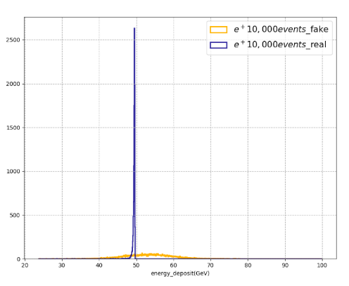
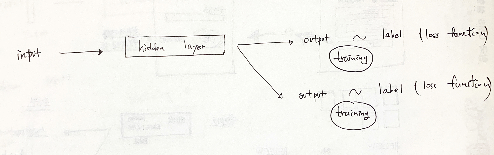
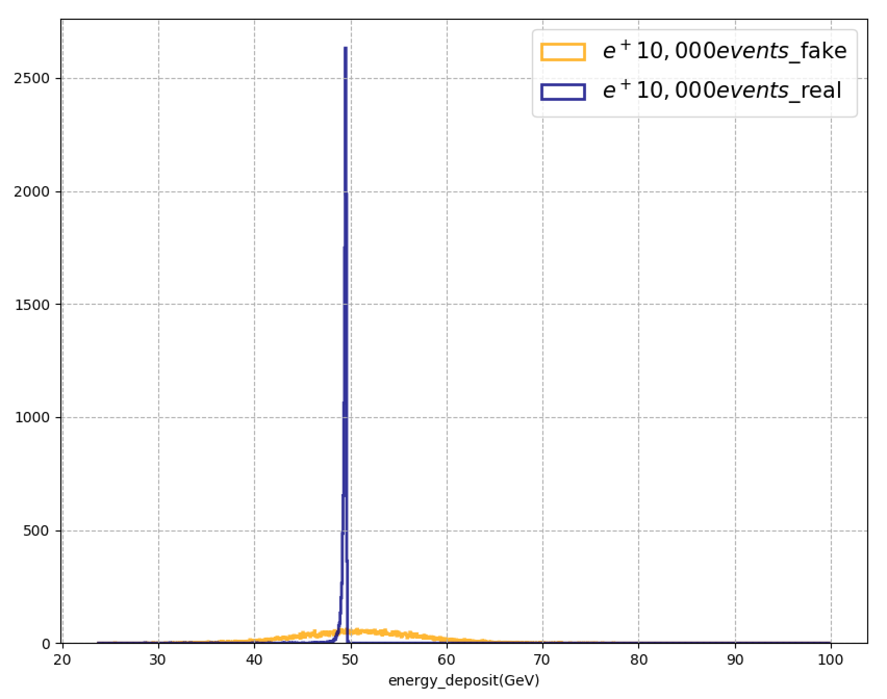

GAN의 학습능력을 올리기 위해 많은 고민을 하고 있다. 먼저 wasserstein distance를 이용해서 학습을 해봤는데, 오히려 GAN보다 **더 안좋은 결과물을 보여줬다.** (물론 WGAN이 GAN보다 더 좋은 결과를 내는 것은 아니다. 안정성이 높을 뿐이다.)

그래서 WGAN을 버리고 GAN을 사용하자니... wasserstein distance 개념은 GAN 영역에서 두루두루 쓰이는 것 같아 쉽게 놓기가 힘들다. 그래서 WGAN 학습을 가져가되 다른 여러가지 시도를 해보고 있다.

## Problem

먼저 내 연구 주제는 입자물리학에 관련된 것임을 밝힌다. 몬테카를로 방식으로 입자를 시뮬레이션 하던 방식을 GAN을 통해 시뮬레이션 하고자 한다. 복잡할 것 없이 어떤 **이미지를 training 시켜서 비슷하게 generating 하는 것이 목적이다.** 내가 generating 하고자 하는 이미지는 `24x24의 이미지`이고 각 픽셀이 가지고 있는 값이 중요하다. (shape도 물론 중요하지만 shape은 일단 크게 복잡하지 않은 이미지이다.) 그래서 **최종적으로 GAN이 generating한 이미지 중 pixel 값의 distribution을 토대로 학습이 잘 되었는지 판단할 것이다.**


위의 그림은 내가 training 시키고 있는 이미지이다. 단순하지만 단순해서 학습이 더 잘 안된다. 가운데에 있는 pixel이 값이 가장 높다.



WGAN으로 training 이후, `각 image의 픽셀 값을 모두 더한` histogram이다. 10,000개의 데이터(real image-파란색, generated image-노란색), 평균은 비슷할 것 같지만... deviation이 너무 심하다. ~~사실 GAN으로 학습하면 편차가 오히려 더 작고 평균값에 가깝다.~~

어쨌든, 픽셀 값 총합이 50에 **최대한 가까운** 이미지가 **최대한 많이** 나오게 해야한다.

## output 2개, loss function 2개

GAN은 discriminator와 generator가 적대적인 관계를 형성하여 epoch이 지나감에 따라 성능이 좋은 쪽이 오락가락한다.

원래는 discriminator와 generator 각각 `binary cross entropy`라는 loss function을 사용하여 label을 `yes` or `no`로 준 뒤, generator가 만들어 낸 이미지를 discriminator가 `yes`라고 판단할 때 까지 학습을 시킨다. 

WGAN은 loss function을 다르게 준다. wasserstein distance라는 개념을 사용하는데, 이는 `예측값이 존재하는 확률분포`와 `실제 정답이 존재하는 확률분포`의 거리를 측정하는 것이다. 이 거리를 loss function으로 사용하면 거리가 줄어드는 방향으로 학습하므로  알맞은 loss function이라고 볼 수 있다.

이부분은 나중에 따로 설명하는 것이 좋겠다.

**위에서 histogram 결과를 보면 편차가 매우 크므로 각 픽셀값 총합에 대한 학습도 같이 이루어져야 한다고 생각했다.** 그래서 loss function을 두개를 쓰는 것이 어떨까 생각했는데, 처음에는 조금 버벅이다가 지금은 동일한 output 2개를 내뱉고, 동일한 loss function 2개를 사용하고 있는 네트워크를 구성했다. ~~동일한 loss function 2개를 사용하는 특별한 이유는 없고, loss function 2개를 동시에 사용해본 적이 없어서... 차근차근 테스트하며 코딩하다가 궁금증에 training을 돌리고 있다.~~



output 2개를 뽑고 각각 loss function이 적용되는 부분을 보자.

```python
#...
def create_generator():
  G = Sequential()
  G.add(Dense(6*6*128, input_dim=latent_dim))
  G.add(Reshape(6, 6, 128))
  G.add(BatchNormalization(momentum=0.9))
 	G.add(LeakyReLU())
  G.add(Dropout(0.3))
  
  G.add(UpSampling2D())
  G.add(Conv2DTranspose(64, 3, padding='same'))
  #...
  return G

def create_discriminator():
  D = Sequential()
  D.add(Conv2D(16, 3, strides=2, padding='same', input_shape=(24, 24, 1)))
	D.add(LeakyReLU())
	D.add(Dropout(0.3))
  #...
  return D
#...

## Discriminator Network
discriminatorNets = create_discriminator()
discriminatorModel = discriminatorNets
optim_discriminator = RMSprop(lr=0.0008, clipvalue=1.0, decay=1e-10)
discriminatorModel.compile(loss=wasserstein_loss, optimizer=optim_discriminator, metrics=['accuracy'])

## Adversarial Network
for layer in discriminatorModel.layers:
  layer.trainable =False
generatorNets = create_generator()

gan_input = Input(shape=(latent_dim, ))
x = generatorNets(gan_input)
gan_output = discriminatorNets(x)
optim_adversarial = RMSprop(lr=0.0004, clipvalue=1.0, decay=1e-10)
## 2 output
ganModel = Model(gan_input, [gan_output, gan_output])
## 2 loss function
ganModel.compile(loss=[wasserstein_loss, wasserstein_loss], optimizer=optim    _adversarial, metrics=['accuracy'])

#...
```

해맸던 곳은, 두개의 output을 내놓을 거라면 어디 부분에서 layer가 갈라지는지 명확하게 알아야 했는데 그러지 못했다. 처음에는 `create_generator()`함수에서 output이 두개로 나오도록 설정했는데 당연하게도 **discriminator와 합쳐지는 부분에서 input 값이 2배가 되어 있어 error가 발생했다. (generator에서 나오는 output은 discriminator의 input이 되므로)** 

그리고 `함수`인지, `텐서`인지 자꾸 헷갈려서 해맸다. 만약 `create_generator(parameter)`로 사용하면 `create_generator`는 함수이므로 `parameter`를 인자로 전달해 함수를 실행하지만, 위에서는 인자를 받을 수 없도록 되어 있으므로 error가 발생한다. 그런데 `generatorNets = create_generator(); generatorNets(gan_input);`을 하면 이미 실행된 `create_generator()`가 `tensor G`를 뱉어내고 `tesor G`에 input값 `gan_input`이 들어가서 layer들을 통과하게 된다. 정말 간단한 문제인데도 헷갈린다.

결과는 아마도 loss function 하나로 사용할 때와 거의 같겠지? 

한번의 학습에 같은 두개의 loss function이 적용되었으므로 두개의 loss function이 선형으로 결합한 `2*loss_function`으로 학습되지 않았을까?



역시나 비슷하게 나온다. 다음에는 같은 loss function이 아닌 다른 loss function을 적용해보도록 하자.